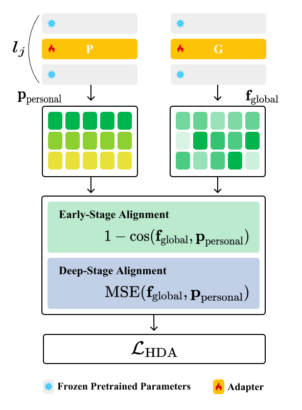
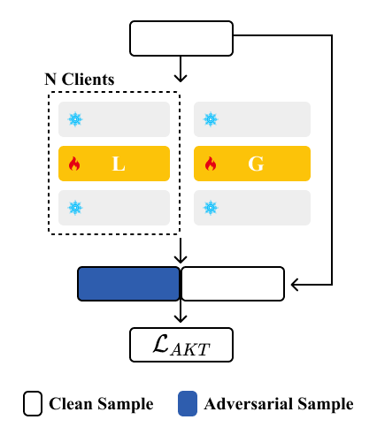

# HEART-PFL

[-0077b6?style=for-the-badge)](https://wacv2026.thecvf.com/)
[](https://pytorch.org/)

This repository is the official implementation of **HEART-PFL**.

> **Authors:** Minjun Kim, Minje Kim

---

## 📝 Abstract

Personalized Federated Learning (PFL) aims to deliver effective client-specific models under heterogeneous data distributions. However, existing approaches often suffer from shallow prototype alignment and brittle server-side knowledge transfer.

To address these limitations, we propose **HEART-PFL**, a dual-sided framework designed to balance hierarchical semantics and global stability:

* **Hierarchical Directional Alignment (HDA):** A client-side mechanism that performs depth-aware alignment. It enforces cosine similarity in early layers for directional consistency and mean-squared matching in deeper layers for semantic precision.
* **Adversarial Knowledge Transfer (AKT):** A server-side strategy that strengthens ensemble knowledge transfer via bidirectional, symmetric-KL distillation on both clean and adversarial proxy samples.

<table width="100%">
  <tr>
    <td align="center" width="19%">
      
      <br>
      <em>(a) Hierarchical Directional Alignment (HDA)</em>
    </td>
    <td align="center" width="30%">
      
      <br>
      <em>(b) Adversarial Knowledge Transfer (AKT)</em>
    </td>
  </tr>
</table>

**Key Results:**
Implemented with lightweight adapters (**1.46M** parameters), HEART-PFL achieves state-of-the-art accuracy on Dirichlet non-IID partitions:
* **CIFAR-100:** 63.42%
* **Flowers-102:** 84.23%
* **Caltech-101:** 95.67%
## 🛠️ Installation

We recommend using **Anaconda** to manage the environment.

```bash
# 1. Clone the repository
git clone [https://github.com/minjun-kim/HEART-PFL.git](https://github.com/minjun-kim/HEART-PFL.git)
cd HEART-PFL

# 2. Create environment
conda create -n heart-pfl python=3.8

# 3. Activate environment
conda activate heart-pfl

# 4. Install PyTorch & CUDA toolkit
conda install pytorch==1.12.0 torchvision==0.13.0 cudatoolkit=11.3 -c pytorch

# 5. Install dependencies
pip install -r requirements.txt
```
## 📂 Dataset

This project uses `torchvision.datasets`. When you run the training script, the datasets will be **automatically downloaded** to your data directory.

We evaluate our method on the following benchmarks:

* **[CIFAR-100](https://www.cs.toronto.edu/~kriz/cifar.html)**
* **[Oxford 102 Flowers (Flowers-102)](https://www.robots.ox.ac.uk/~vgg/data/flowers/102/)**
* **[Caltech-101](http://www.vision.caltech.edu/Image_Datasets/Caltech101/)**

---

## 🚀 Train

To train the model, run the shell scripts provided in the `scripts` directory.
Hyperparameters (e.g., learning rate, batch size, partition alpha) can be modified directly inside each `.sh` file.

### CIFAR-100
```bash
bash scripts/cifar100/ours.sh
```
### Flower-102
```bash
bash scripts/flower102/ours.sh
```
### Catech-101
```bash
bash scripts/caltech101/ours.sh
```
